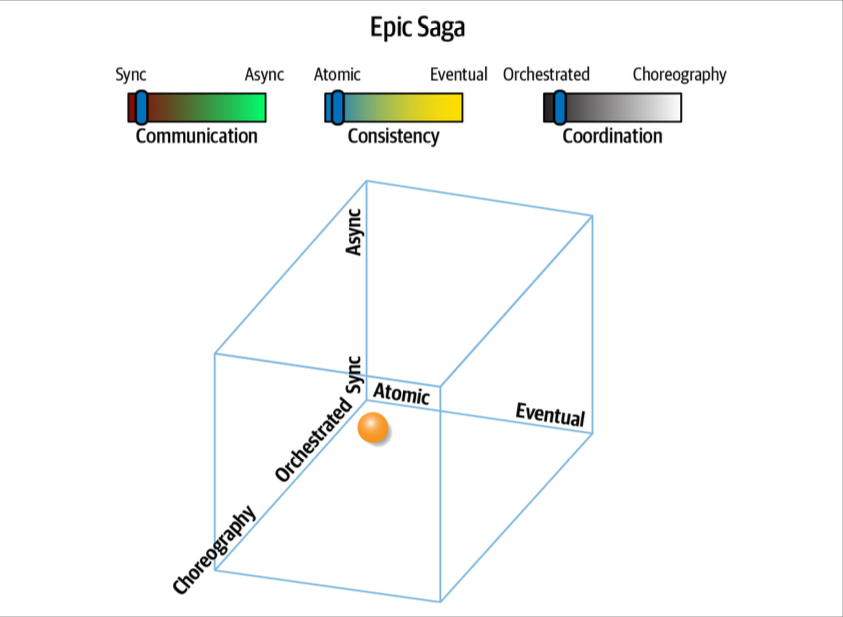
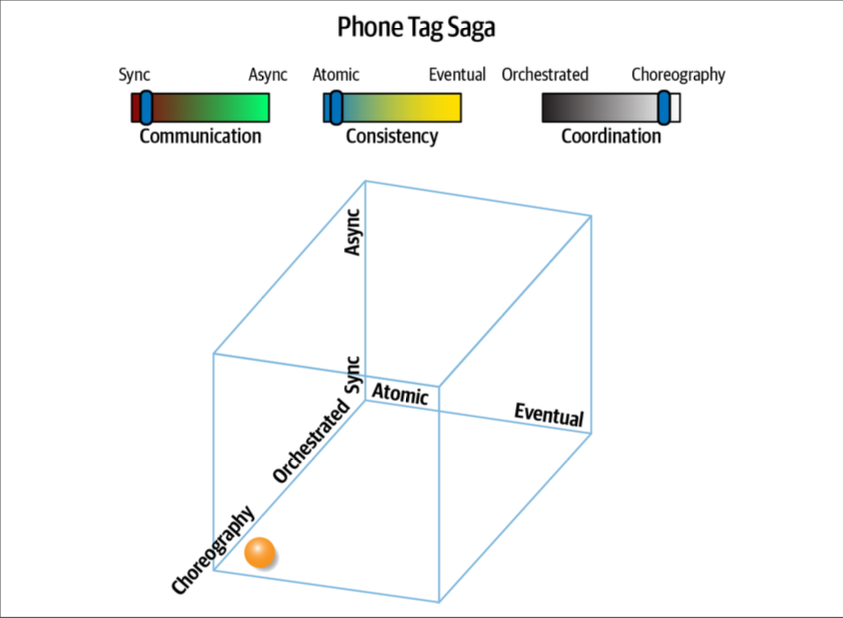
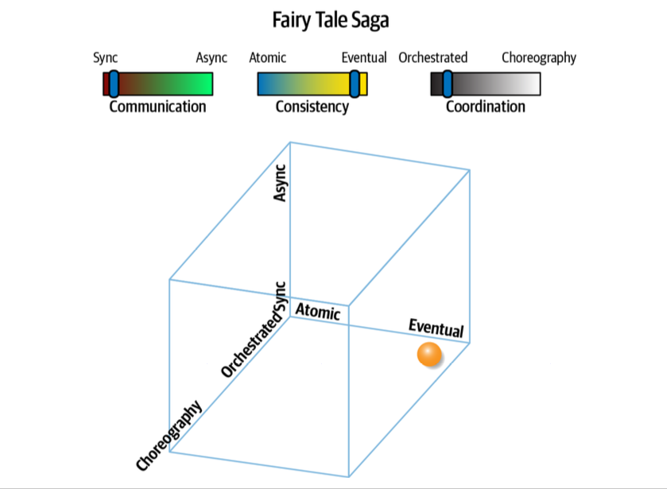
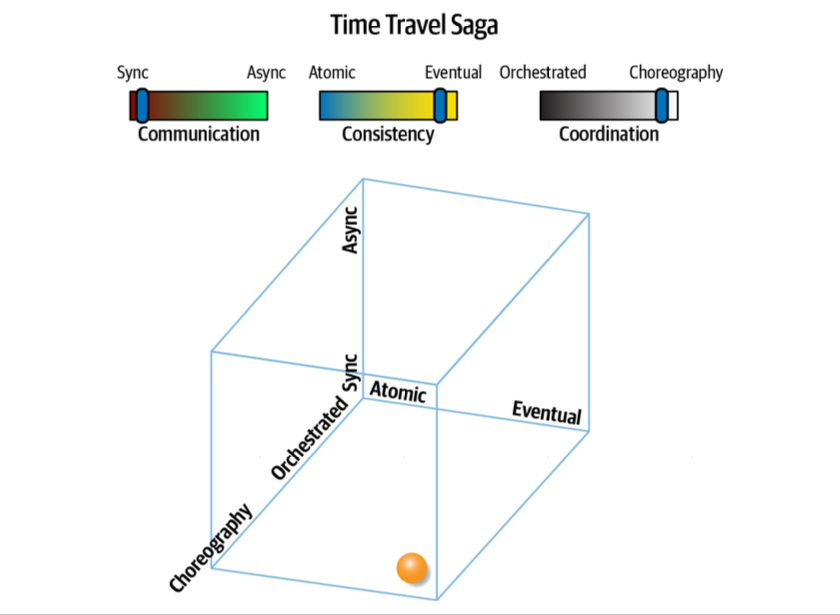
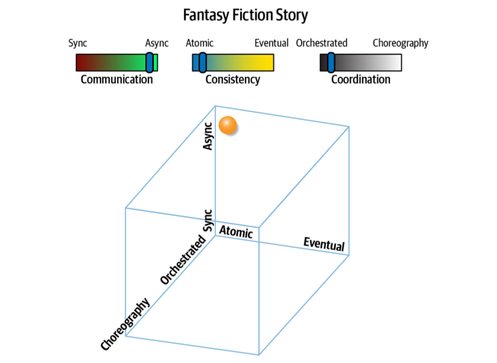
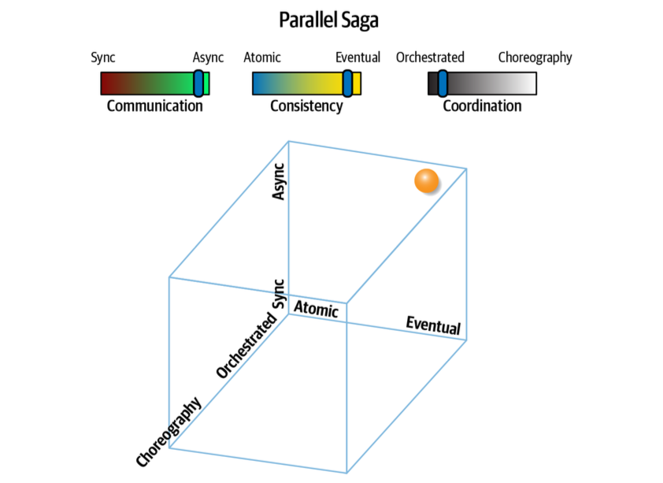
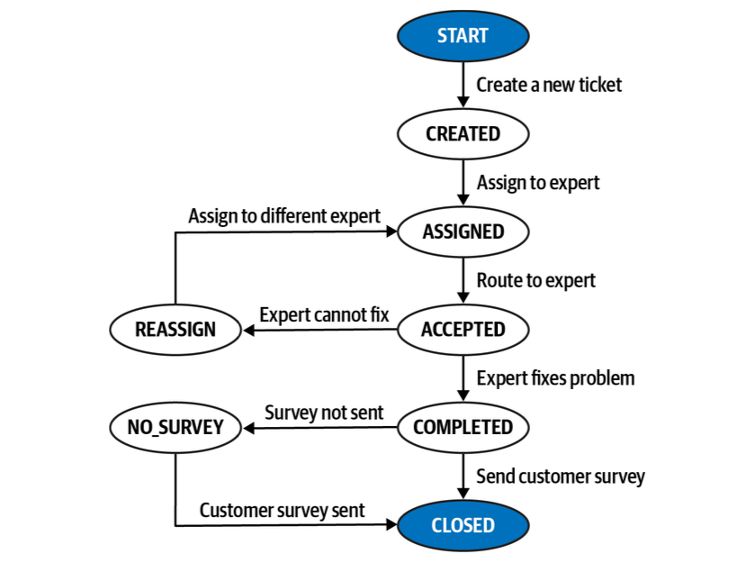

# Transaction Saga Pattern

## Introduction

The concept of a saga in architecture predates microservices, originally concerned with limiting the scope of database locks in early distributed architectures.

the saga pattern for microservices as a sequence of local transactions where each update publishes an event, thus triggering the next update in the sequence. If a failure occurs, the saga executes compensating transactions that counteract the preceding updates. - Chris Richardson

There are 8 different types of sagas:

<!-- a table with 9 row and 4 columns  -->
| Pattern Name | Communication | Consistency | Coordination |
| --- | --- | --- | --- |
| Epic Saga | Synchronous | Atomic | Orchestrated |
| Phone Tag Saga | Synchronous | Atomic | Choreographed |
| Fairy Tale Saga | Synchronous | Eventual | Orchestrated |
| Time Travel Saga | Synchronous | Eventual | Choreographed |
| Fantasy Fiction Saga | Asynchronous | Atomic | Orchestrated |
| Horror Story Saga | Asynchronous | Atomic | Choreographed |
| Parallel Saga | Asynchronous | Eventual | Orchestrated |
| Anthology Saga | Asynchronous | Eventual | Choreographed |

## Epic Saga Pattern

This type of communication is the “traditional” saga pattern as many architects understand it, also called an Orchestrated Saga because of its coordination type. This pattern utilizes synchronous communication, atomic consistency, and orchestra‐ ted coordination.

an orchestrator service orchestrates a workflow that includes updates for three services, expected to occur in a transactional manner where either all three calls succeed or none do.
such transactions limit the choice of databases and have legendary failure modes.

as with many things in architecture, the error conditions cause the difficulties. In a compensating transaction framework, the mediator monitors the success of calls, and issues compensating calls to other services if one or more of the requests fail.

The clear advantage of the Epic Saga(sao) is the transactional coordination that mimics monolithic systems, coupled with the clear workflow owner represented via an orchestrator However, the disadvantages are varied. First, orchestration plus transactionality may have an impact on operational architecture characteristics such as performance, scale, elasticity, and so on—the orchestrator must make sure that all participants in the transaction have succeeded or failed, creating timing bottlenecks.

### Rating

| Epic Saga Pattern | Rating |
| --- | --- |
| Communication | Synchronous |
| Consistency | Atomic |
| Coordination | Orchestrated |
| Coupling | High |
| Complexity | High |
| Responsiveness/Availability | Low |
| Scale/elasticity | Very Low |

## Phone Tag Saga Pattern

The Phone Tag Saga(sac) pattern changes one of the dimensions of the Epic Saga(sao), changing coordination from orchestrated to choreographed.

The pattern name is Phone Tag because it resembles a well-known children’s game known as Telephone in North America: children form a circle, and one person whispers a secret to the next person, who passes it along to the next, until the final version is spoken by the last person.

How does choreography versus orchestration improve operational architecture characteristics like scale? Using choreography even with synchronous communication cuts down on bottlenecks—in non-error conditions, the services can operate independently, and the overall system can scale more easily.

A nice feature of non-orchestrated architectures is the lack of a coupling singularity, a single place the workflow couples to.

### Rating - Phone Tag Saga Pattern

| Phone Tag Saga Pattern | Rating |
| --- | --- |
| Communication | Synchronous |
| Consistency | Atomic |
| Coordination | Choreographed |
| Coupling | High |
| Complexity | High |
| Responsiveness/Availability | Low |
| Scale/elasticity | High |

## Fairy Tale Saga Pattern

Typical fairy tales provide happy stories with easy-to-follow plots, thus the name Fairy Tale Saga(seo), which utilizes synchronous communication, eventual consistency, and orchestration.

This communication pattern relaxes the difficult atomic requirement, providing many more options for architects to design systems. For example, if a service is down temporarily, eventual consistency allows for caching a change until the service restores.

In this pattern, an orchestrator exists to coordinate request, response, and error handling. However, the orchestrator isn’t responsible for managing transactions, which each domain service retains responsibility for. Thus the orchestrator can manage compensating calls, but without the requirement of occurring within an active transaction.

The biggest appealing advantage of the Fairy Tale Saga(seo) is the lack of holistic trans‐ actions. Each domain service manages its own transactional behavior, relying on eventual consistency for the overall workflow.

### Rating - Fairy Tale Saga Pattern

| Fairy Tale Saga Pattern | Rating |
| --- | --- |
| Communication | Synchronous |
| Consistency | Eventual |
| Coordination | Orchestrated |
| Coupling | High |
| Complexity | Very Low |
| Responsiveness/Availability | Medium |
| Scale/elasticity | High |

## Time Travel Saga Pattern

The Time Travel Saga(sec) pattern features synchronous communication, and eventual consistency, but choreographed workflow. In other words, this pattern avoids a central mediator, placing the workflow responsibilities entirely on the participating domain services.

In this workflow, each service accepts a request, performs an action, and then for‐ wards the request on to another service. This architecture can implement the Chain of Responsibility design pattern or the Pipes and Filters architecture style.

Each service in this pattern “owns” its own transactional operations, so architects must design workflow error conditions into the domain design. this pattern is best suited for simple workflows with few services, as the complexity of error handling increases with each additional service.

For solutions that benefit from high throughput, this pattern works extremely well for “fire and forget” style workflows, such as electronic data ingestion, bulk transactions, and so on.

Because this pattern lacks holistic transactional coordination, architects must take extra effort to synchronize data.

### Rating - Time Travel Saga Pattern

| Time Travel Saga Pattern | Rating |
| --- | --- |
| Communication | Synchronous |
| Consistency | Eventual |
| Coordination | Choreographed |
| Coupling | Medium |
| Complexity | Low |
| Responsiveness/Availability | Medium |
| Scale/elasticity | High |

## Fantasy Fiction Saga Pattern

Traditionally, one way that architects increase the responsiveness of distributed systems is by using asynchronicity, allowing operations to occur in parallel rather than serially. This may seem like a good way to increase the perceived performance over an Epic Saga.

Adding asynchronicity to orchestrated workflows adds asynchronous transactional state to the equation, removing serial assumptions about ordering and adding the possibilities of deadlocks, race conditions, and a host of other parallel system challenges.

### Rating - Fantasy Fiction Saga Pattern

| Fantasy Fiction Saga Pattern | Rating |
| --- | --- |
| Communication | Asynchronous |
| Consistency | Atomic |
| Coordination | Orchestrated |
| Coupling | High |
| Complexity | High |
| Responsiveness/Availability | Low |
| Scale/elasticity | Low |

## Horror Story Saga Pattern

One of the patterns must be the worst possible combination; it is the aptly named Horror Story(aac) pattern, characterized by asynchronous communication, atomic consistency, and choreographed coordination.

Why is this combination so horrible? It combines the most stringent coupling around consistency (atomic) with the two loosest coupling styles, asynchronous and choreography.

### Rating - Horror Story Saga Pattern

| Horror Story Saga Pattern | Rating |
| --- | --- |
| Communication | Asynchronous |
| Consistency | Atomic |
| Coordination | Choreographed |
| Coupling | Medium |
| Complexity | Very High |
| Responsiveness/Availability | Low |
| Scale/elasticity | Medium |

## Parallel Saga Pattern

The Parallel Saga(aeo) pattern is named after the “traditional” Epic Saga(sao) pattern with two key differences that ease restrictions and therefore make it an easier pattern to implement: asynchronous communication and eventual consistency. The dimensional diagram of the Parallel Saga(aeo) pattern.

This pattern uses a mediator, making it suitable for complex workflows. However, it uses asynchronous communication, allowing for better responsiveness and parallel execution. Consistency in the pattern lies with the domain services, which may require some synchronization of shared data, either in the background or driven via the mediator. As in other architectural problems that require coordination, a mediator becomes quite useful.

For example, if an error occurs during the execution of a workflow, the mediator can send asynchronous messages to each involved domain service to compensate for the failed change, which may entail retries, data synchronization, or a host of other remediations.

Asynchronous communication, while offering better responsiveness, makes resolving timing and synchronization issues difficult—race conditions, deadlocks, queue reliability, and a host of other distributed architecture headaches reside in this space.

### Rating - Parallel Saga Pattern

| Parallel Saga Pattern | Rating |
| --- | --- |
| Communication | Asynchronous |
| Consistency | Eventual |
| Coordination | Orchestrated |
| Coupling | Low |
| Complexity | Low |
| Responsiveness/Availability | High |
| Scale/elasticity | High |

## Anthology Saga Pattern

The Anthology Saga(aec) pattern provides the exact opposite set of characteristics to the traditional Epic Saga(sao) pattern: it utilizes asynchronous communication, eventual consistency, and choreographed coordination, providing the least coupled exemplar among all these patterns.

The anthology pattern uses message queues to send asynchronous messages to other domain services without orchestration.

The lack of orchestration makes services more complex but allows for much higher throughput, scalability, elasticity, and other beneficial operational architecture characteristics. No bottlenecks or coupling choke points exist in this architecture, allow‐ ing for high responsiveness and scalability.

However, this pattern doesn’t work particularly well for complex workflows, especially around resolving data consistency errors. While it may not seem possible without an orchestrator, the Anthology Saga(aec) pattern can still provide a high level of responsiveness and scalability.

### Rating - Anthology Saga Pattern

| Anthology Saga Pattern | Rating |
| --- | --- |
| Communication | Asynchronous |
| Consistency | Eventual |
| Coordination | Choreographed |
| Coupling | Very Low |
| Complexity | High |
| Responsiveness/Availability | High |
| Scale/elasticity | Very High |

## Conclusion

The saga pattern provides a way to manage transactions and workflows in a distributed system. The pattern is a sequence of local transactions where each update publishes an event, thus triggering the next update in the sequence. If a failure occurs, the saga executes compensating transactions that counteract the preceding updates.

## State Management and Eventual Consistency

State management and eventual consistency leverage finite state machines to always know the current state of the transactional saga, and to also eventually correct the error condition through retries or some sort of automated or manual corrective action.

By managing the state of the saga rather than issuing compensating updates, the end user (in this case, the Sysops Squad expert) doesn’t need to be concerned that the sur‐ vey was not sent to the customer—that responsibility is for the Ticket Orchestrator Service to worry about. Responsiveness is good from the end user’s perspective, and the user can work on other tasks while the errors are handled by the system.

## Saga State Machines

A state machine is a pattern that describes all of the possible paths that can exist within a distributed architecture. A state machine always starts with a beginning state that launches the transactional saga, then contains transition states and corresponding action that should occur when the transition state happens.

To illustrate how a saga state machine works, consider the following workflow of a new problem ticket created by a customer in the Sysops Squad system:

1. The customer enters a new problem ticket into the system.
2. The ticket is assigned to the next available Sysops Squad expert.
3. The ticket is then routed to the expert’s mobile device.
4. The expert receives the ticket and works on the issue.
5. The expert finishes the repair and marks the ticket as complete.
6. A survey is sent to the customer.

